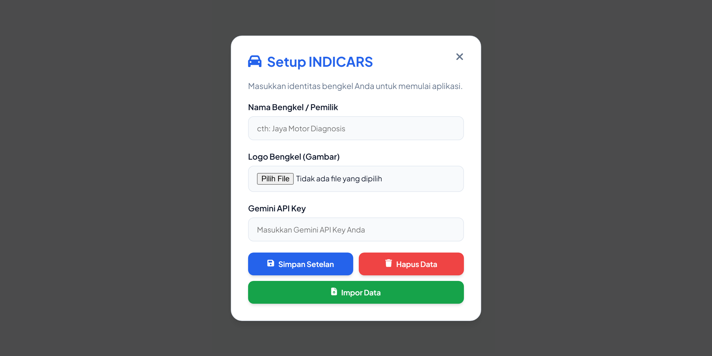
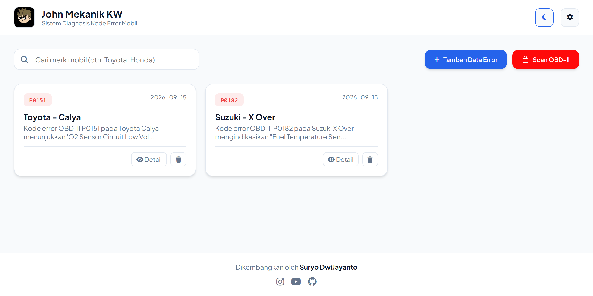
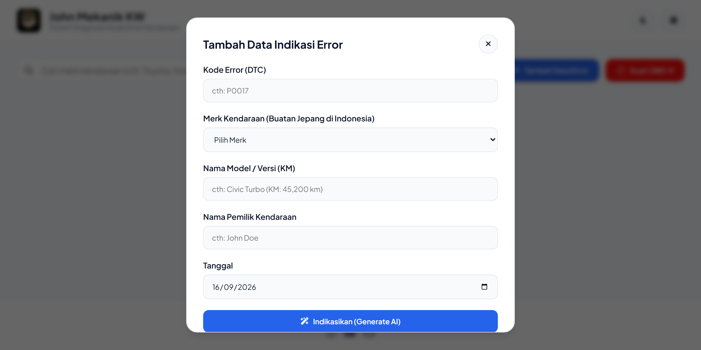
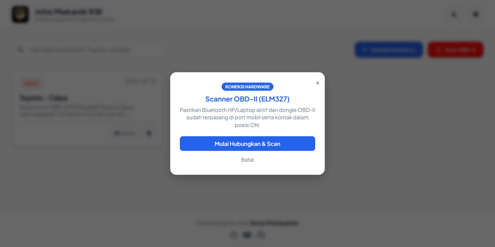
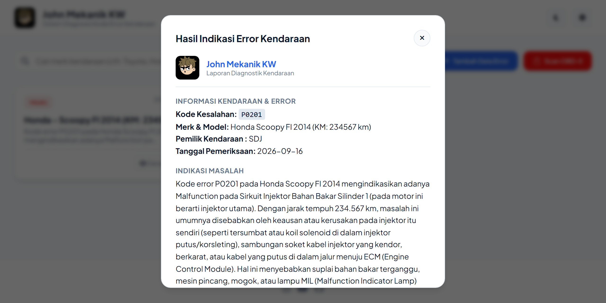
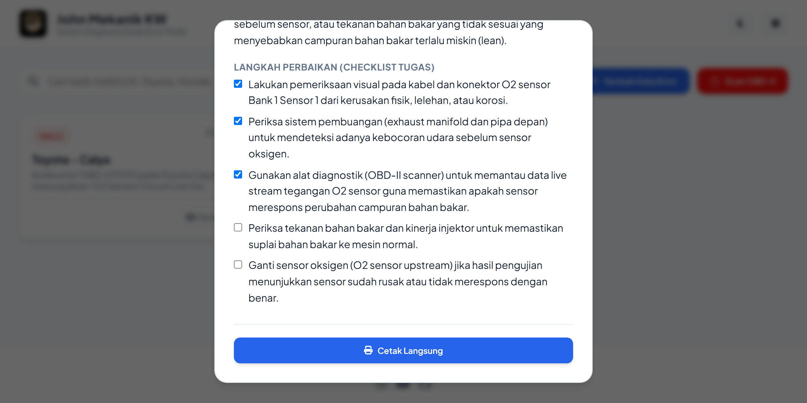

# Indicars
Aplikasi berbasis AI untuk mendiagnosis kode error mobil (OBD-II), mengetahui indikasi masalah, dan panduan perbaikan secara akurat dan cepat.

## Table Gambar
| Setup | Dashboard | Tambah Data |
| :---: | :---: | :---: |
|  |  |  |
| Tampilan Data/Setelan | Tampilan dashboard dan data pada kartu | Tampilan menambahkan data error baru |

| Koneksi OBD II | Isi Kartu | Isi Kartu Ke Bawah |
| :---: | :---: | :---: |
|  |  |  |
| Langsung buat indikasi dengan Scanner OBD-II (ELM327) | Tampilan isi kartu | Tampilan isi kartu kebawah |

## Setup & Integrasi Gemini API Key
1. Masukkan nama bengkel anda.
2. Pilih logo/gambar bengkel anda.
3. Buat api key > [disini](https://aistudio.google.com/api-keys) lalu tempel api key anda.
4. Simpan

## Fitur
> Tema Terang/Gelap

> Minimalis UI/UX Responsive

> Pencarian data yang tersimpan

> Membuat data Error

> Menghapus data pada daftar kartu    

> Menganalisa kesalahan berdasarkan kode dari OBD II (by generate AI)

> Mencatat dan menampilkan indikasi masalah

> Memberitahukan cara langkah perbaikan dengan tugas ceklis pada daftar jika sudah dilakukan

> Print langsung

### Menambahkan Data Error
Klik tombol {+ Tambah Data Error}
- Masukkan Kode Error (DTC)
- Pilih Merk Mobil (Buatan Jepang di Indonesia)
- Masukkan Nama Mobil / Versi
- Masukkan Nama Pemilik Mobil
- Sesuaikan tanggal
- Klik Tombol Indikasikan

### Pairing OBD II/ELM327
- Hubungan perangkat (Pastikan Kunci Mobil On)
- Ijinkan Perangkat di sekitar (Mobile/HP)
- Lakukan scan dan dapatkan hasil deteksi (by generate AI)
- Reset ecu error (tergantung fungsi dari alat OBD II/ELM327)

### Pasang Aplikasi Pada Perangkat
1. Desktop > Khusus peramban chrome kamu bisa klik ikon komputer di sebelah ikon borkmark (bintang) atau klik titik 3/lainnya pilih > transimisikan, simpan, dan bagikan > install INDICARS.
2. Mobile > Klik titik 3 pada peramban chrome gulir dan pilih install dan buat pintasan.

Tautan resmi > https://spanelweb.github.io/indicars

### Catatan
``` txt
Semua data disimpan secara lokal! Kami tidak menyimpan data secara online.
Lakukan penyimpanan secara mandiri dengan mengexport data yang sudah anda buat.
import .indicars anda untuk pemulihan data.
Segala resiko di tanggung sendiri!
Kami hanya mengembangkan web aplikasi dengan tujuan membantu/memudahkan.
```


Hormat Saya,

~ Suryo DwiJayanto
